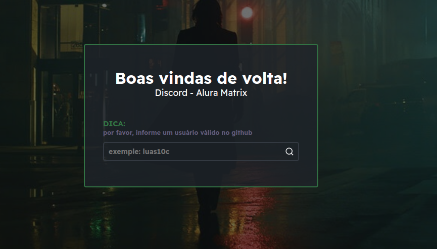

# Imersão React Alura 04
## Alura Matrix

Imagens da aplicação

> ## Como executar o projeto
> Sigas os passos a seguir
> * Você precisa do gerenciador de pacotes do nodejs.
> * Em caso de yarn você deve utilizar o comando yarn dev
> * em caso de npm você deve utilizar npm run dev
> * Só aguardar até a aplicação ser inciada e acessar o ip que foi exibido no terminal